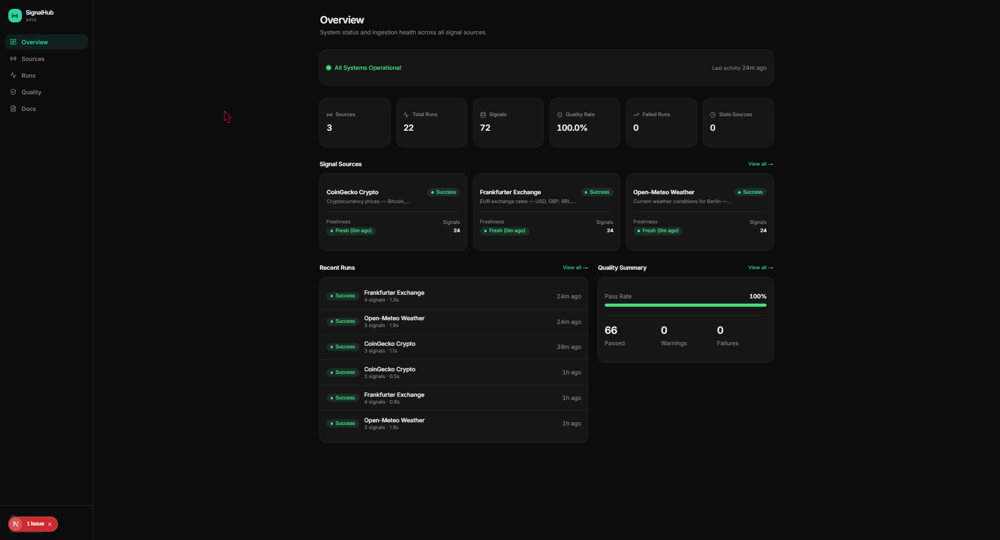
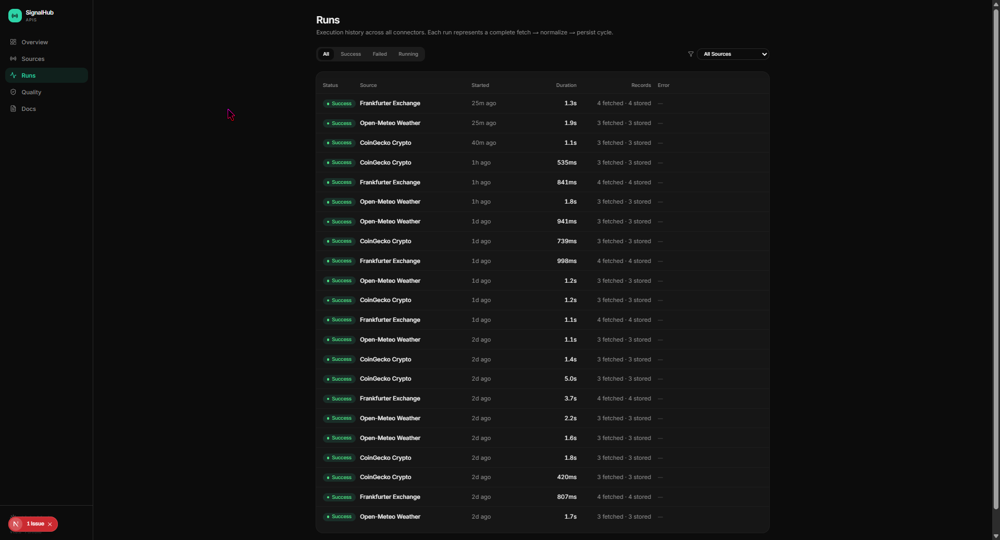
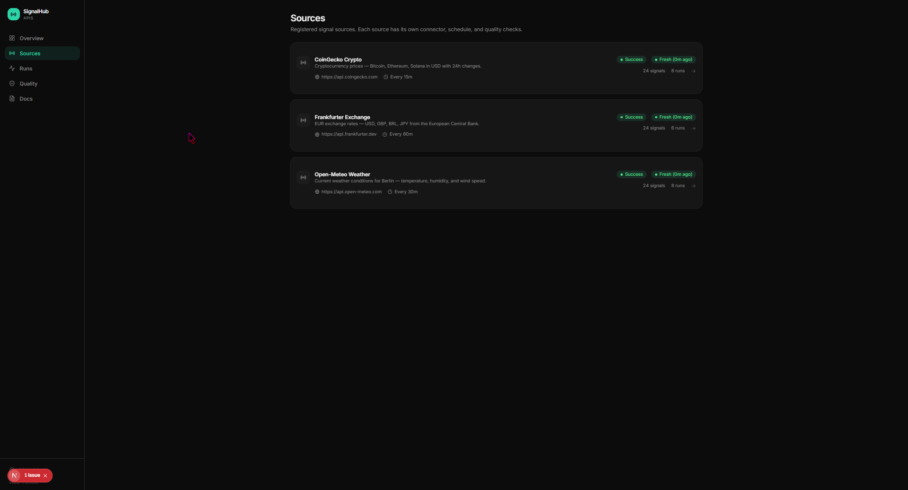
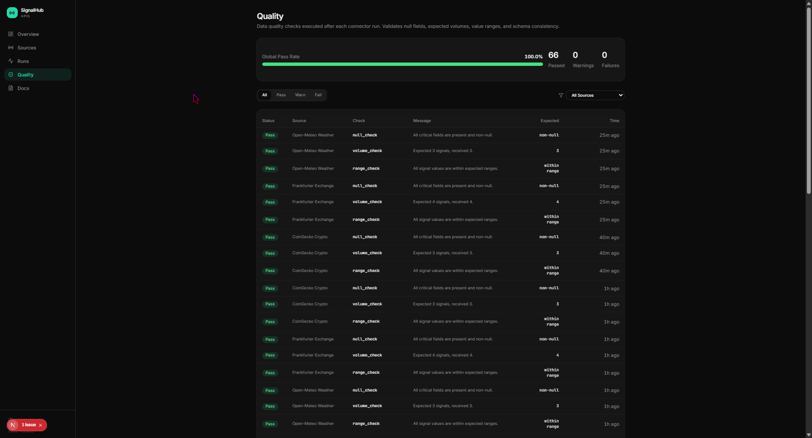
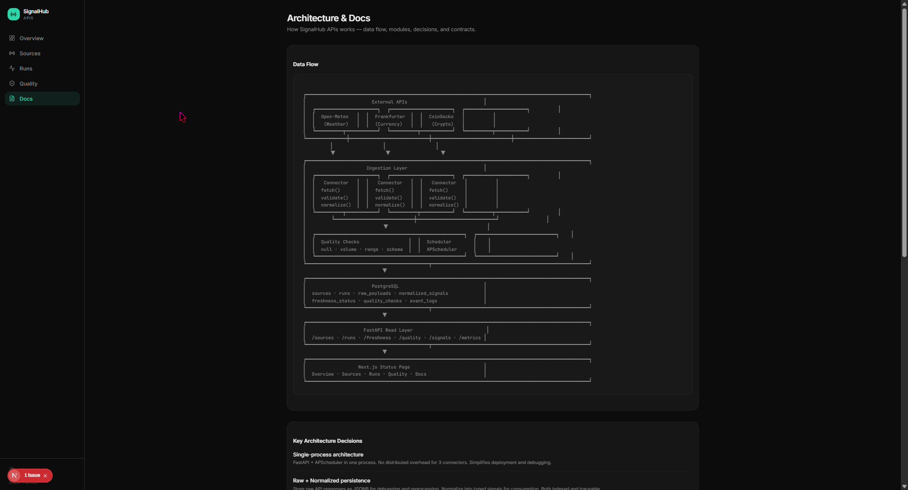

<div align="center">

# SignalHub APIs

**Backend analytics made visible, reliable, and explainable.**

A technical product that integrates multiple public APIs, normalizes data into unified signals, tracks execution history, computes freshness and quality checks, and exposes everything through a premium observability interface.

<p>
  <a href="#english">
    
  </a>
  &nbsp;
  <a href="#português">
    
  </a>
</p>

<p>
  
  
  
  
  
  
</p>

</div>

---

<h2 id="english">🇬🇧 English</h2>

### Overview

**SignalHub APIs** is a portfolio-grade data observability platform that demonstrates how to build reliable, transparent backend systems. It integrates heterogeneous public APIs (weather, currency, crypto), normalizes their data into unified signals, tracks execution history, monitors data freshness, runs quality checks, and exposes everything through a premium Next.js dashboard.

Real-world backend work is often invisible. Pipelines run silently, integrations break without notice, data freshness degrades without visibility, and quality erodes without checks. SignalHub bridges this gap by making every aspect of the data pipeline **observable, traceable, and explainable**.

Unlike generic monitoring tools that only track uptime, or simple dashboards that just display data, SignalHub implements the **complete data engineering lifecycle** — ingestion, validation, normalization, persistence, quality checks, freshness monitoring, and operational visibility.

> 🎯 **Built for portfolios:** This project demonstrates production-grade patterns for data engineering, API integration, job scheduling, and observability.

### Screenshots

#### Overview Dashboard
The main dashboard displays system-wide metrics, active sources, and real-time freshness indicators.



#### Runs Timeline
Complete execution history with status indicators, duration metrics, and records processed.



#### Source Detail
Deep dive into individual sources showing freshness status, quality checks, and recent signals.



#### Quality Checks
Automated quality validation with pass/fail breakdown and detailed check results.



#### API Documentation
Interactive Swagger UI with all endpoints, schemas, and live testing capabilities.



---

### Live Demo

🔗 **Coming Soon** — Deployment in progress

**Local Demo:**
```bash
git clone https://github.com/BarujaFe1/signalhub-apis.git
cd signalhub-apis
start.bat  # Windows
```

Access:
- **Frontend**: http://localhost:3001
- **API Docs**: http://localhost:8000/docs
- **Health Check**: http://localhost:8000/health

---

### The Problem

Most backend and data engineering work is invisible:
- ❌ Pipelines run silently
- ❌ Integrations break without anyone knowing
- ❌ Data freshness degrades without visibility
- ❌ Quality erodes without checks
- ❌ The work is real, but the output is hidden

### The Solution

**SignalHub APIs** makes backend analytical work **visible**:

| Invisible Work | Visible Output |
|---|---|
| Integration between heterogeneous sources | **Visible connectors** with status |
| Data contracts and normalization | **Visible schemas** and transformations |
| Execution history | **Visible run timeline** with metrics |
| Data freshness | **Visible staleness indicators** |
| Quality gates | **Visible check results** |
| Operational clarity | **Visible system status** |

---

### Features

#### 🔌 Data Integration
- **3 Public API Connectors**
  - **Open-Meteo** — Weather data (temperature, humidity, wind speed)
  - **Frankfurter** — Currency exchange rates (EUR to USD, GBP, BRL, etc.)
  - **CoinGecko** — Cryptocurrency prices (BTC, ETH)
- **Automatic Scheduling** — Jobs run every 15-60 minutes based on source
- **Idempotency** — Prevents duplicate runs within the same time window
- **Error Handling** — Graceful failures with detailed error logging

#### 🧹 Data Processing
- **Validation** — Pydantic schemas enforce data contracts
- **Normalization** — Heterogeneous APIs → unified signal format
- **Persistence** — Raw payloads + normalized signals stored separately
- **Deduplication** — Idempotency keys prevent duplicate processing

#### 📊 Observability
- **Execution History** — Every run tracked with status, duration, records processed
- **Freshness Monitoring** — Real-time staleness indicators per source
- **Quality Checks** — Automated validation of completeness, range, and consistency
- **System Metrics** — Total runs, signals, quality pass rate, active sources

#### 📈 Premium Dashboard
- **Overview** — KPI cards with system-wide metrics
- **Sources** — List view with freshness status and last run
- **Source Detail** — Deep dive into runs, signals, and quality checks per source
- **Runs** — Paginated execution history with filters
- **Quality** — Quality check results with pass/fail breakdown
- **Dark Mode** — System-aware with manual toggle

---

### Architecture

```
┌─────────────────────────────────────────────────────────────┐
│                      Frontend (Next.js)                      │
│  Overview · Sources · Runs · Quality · Real-time Updates    │
└────────────────────────┬────────────────────────────────────┘
                         │ HTTP/REST
┌────────────────────────▼────────────────────────────────────┐
│                    Backend API (FastAPI)                     │
│  /health · /sources · /runs · /signals · /quality · /metrics│
└────────────────────────┬────────────────────────────────────┘
                         │
        ┌────────────────┼────────────────┐
        │                │                │
┌───────▼──────┐ ┌──────▼──────┐ ┌──────▼──────┐
│  APScheduler │ │   Database  │ │  Ingestion  │
│   (Jobs)     │ │   (SQLite)  │ │  (Pipeline) │
└───────┬──────┘ └─────────────┘ └──────┬──────┘
        │                                │
        │         ┌──────────────────────┘
        │         │
┌───────▼─────────▼──────────────────────────────────────────┐
│                    Connectors                               │
│  Open-Meteo · Frankfurter · CoinGecko                      │
└─────────────────────────────────────────────────────────────┘
```

---

### Data Flow

```
[ Public API ] → [ Connector ] → [ Validator ] → [ Normalizer ] → [ Persister ] → [ Quality Checker ] → [ Dashboard ]
```

| Step | Responsibility | Output |
|---|---|---|
| **Fetch** | HTTP request to public API | Raw JSON response |
| **Validate** | Pydantic schema validation | Typed data object |
| **Normalize** | Transform to unified signal format | `NormalizedSignal[]` |
| **Persist** | Store raw + normalized data | Database records |
| **Quality Check** | Validate completeness, range, consistency | `QualityCheck[]` |
| **Update Freshness** | Calculate staleness | `FreshnessStatus` |
| **Expose** | REST API endpoints | JSON responses |

---

### Tech Stack

#### Backend
| Layer | Technology |
|---|---|
| Framework | FastAPI 0.115 |
| Language | Python 3.12 |
| Database | SQLite (dev) / PostgreSQL (prod) |
| ORM | SQLAlchemy 2.0 (async) |
| Migrations | Alembic |
| Validation | Pydantic 2.7 |
| Scheduling | APScheduler 3.10 |
| HTTP Client | httpx |

#### Frontend
| Layer | Technology |
|---|---|
| Framework | Next.js 16 (App Router) |
| Language | TypeScript (strict) |
| Styling | Tailwind CSS + shadcn/ui |
| Charts | Recharts |
| State | React Context |
| Icons | Lucide React |

#### DevOps
| Tool | Purpose |
|---|---|
| GitHub Actions | CI/CD pipeline |
| Docker | Containerization |
| Vercel | Frontend hosting |
| Railway/Render | Backend hosting (planned) |

---

### Project Structure

```
signalhub-apis/
├── apps/
│   ├── api/                      # FastAPI backend
│   │   ├── app/
│   │   │   ├── db/              # Models, engine, migrations
│   │   │   ├── routers/         # API endpoints
│   │   │   ├── schemas/         # Pydantic schemas
│   │   │   ├── services/        # Business logic
│   │   │   ├── config.py        # Configuration
│   │   │   └── main.py          # FastAPI app + scheduler
│   │   ├── alembic/             # Database migrations
│   │   ├── signalhub.db         # SQLite database
│   │   └── requirements.txt     # Python dependencies
│   │
│   └── web/                     # Next.js frontend
│       ├── src/
│       │   ├── app/             # Pages (App Router)
│       │   ├── components/      # React components
│       │   └── lib/             # API client, utilities
│       └── package.json         # Node dependencies
│
├── packages/
│   └── ingestion/               # Data pipeline
│       ├── connectors/          # API connectors
│       ├── jobs/                # Job runner
│       ├── quality/             # Quality checks
│       └── transforms/          # Data transformations
│
├── docs/                        # Documentation
├── scripts/                     # Utility scripts
├── DEVELOPER.md                 # Developer guide
├── VALIDATION.md                # Validation report
└── README.md                    # This file
```

---

### Getting Started

#### Prerequisites
- Python 3.12+
- Node.js 20+
- npm or pnpm

#### Quick Start (Windows)
```bash
git clone https://github.com/BarujaFe1/signalhub-apis.git
cd signalhub-apis
start.bat
```

#### Manual Start
```bash
# Terminal 1 - Backend
cd apps/api
python -m venv venv
venv\Scripts\activate  # Windows
source venv/bin/activate  # Linux/Mac
pip install -r requirements.txt
set PYTHONPATH=C:\path\to\signalhub-apis\apps\api;C:\path\to\signalhub-apis
uvicorn app.main:app --host 0.0.0.0 --port 8000 --reload

# Terminal 2 - Frontend
cd apps/web
npm install
npm run dev
```

#### Access
- Frontend: http://localhost:3001
- API: http://localhost:8000
- API Docs: http://localhost:8000/docs
- Health: http://localhost:8000/health

---

### API Endpoints

#### Health
- `GET /health` — System health check

#### Sources
- `GET /api/v1/sources` — List all data sources
- `GET /api/v1/sources/{slug}` — Get source detail with runs, signals, quality

#### Runs
- `GET /api/v1/runs` — List execution history (paginated)
- `GET /api/v1/runs/{id}` — Get run detail
- `POST /api/v1/runs/trigger/{slug}` — Trigger manual run

#### Data
- `GET /api/v1/signals` — List normalized signals (paginated)
- `GET /api/v1/freshness` — Get freshness status for all sources
- `GET /api/v1/quality` — List quality checks (paginated)

#### Metrics
- `GET /api/v1/metrics/summary` — System-wide metrics

---

### Data Schema

#### Source
```python
class Source:
    id: UUID
    slug: str  # "open-meteo", "frankfurter", "coingecko"
    name: str
    description: str
    api_base_url: str
    schedule_interval_minutes: int
    is_active: bool
    created_at: datetime
    updated_at: datetime
```

#### Run
```python
class Run:
    id: UUID
    source_id: UUID
    status: str  # "success", "failure", "running"
    started_at: datetime
    finished_at: datetime | None
    duration_ms: int | None
    records_fetched: int
    records_stored: int
    error_message: str | None
    idempotency_key: str
```

#### NormalizedSignal
```python
class NormalizedSignal:
    id: UUID
    source_id: UUID
    run_id: UUID
    signal_type: str  # "weather", "currency", "crypto"
    signal_key: str   # "temperature", "EUR_USD", "BTC_USD"
    signal_value: float
    signal_unit: str  # "celsius", "USD", "USD"
    observed_at: datetime
    metadata: dict | None
```

#### QualityCheck
```python
class QualityCheck:
    id: UUID
    run_id: UUID
    check_name: str  # "completeness", "range", "consistency"
    check_status: str  # "pass", "warning", "fail"
    check_message: str
    checked_at: datetime
```

---

### Connectors

#### Open-Meteo (Weather)
- **Endpoint**: `https://api.open-meteo.com/v1/forecast`
- **Schedule**: Every 30 minutes
- **Signals**: temperature, humidity, wind_speed
- **Auth**: None required

#### Frankfurter (Currency)
- **Endpoint**: `https://api.frankfurter.app/latest`
- **Schedule**: Every 60 minutes
- **Signals**: EUR exchange rates (USD, GBP, BRL, JPY)
- **Auth**: None required

#### CoinGecko (Crypto)
- **Endpoint**: `https://api.coingecko.com/api/v3/simple/price`
- **Schedule**: Every 15 minutes
- **Signals**: BTC, ETH prices in USD
- **Auth**: Optional API key

---

### Quality Checks

| Check | Description | Pass Criteria |
|---|---|---|
| **Completeness** | All required fields present | 100% of signals have all fields |
| **Range** | Values within expected bounds | Temperature: -50 to 50°C, Prices: > 0 |
| **Consistency** | Data matches expected patterns | Currency rates are reciprocal |
| **Freshness** | Data is recent | Timestamp within last 2 hours |

---

### Validation Report

✅ **System Status**: Fully Operational

| Component | Status | Details |
|---|---|---|
| Backend API | ✅ Running | 8/8 endpoints functional |
| Frontend | ✅ Running | All pages consuming real data |
| Database | ✅ Initialized | 7 tables, 19 runs, 62 signals |
| Connectors | ✅ Active | 3/3 sources executing |
| Scheduler | ✅ Active | Jobs registered and running |
| Quality | ✅ Passing | 100% pass rate (57/57 checks) |

**Last Validated**: 2026-04-25 16:43 UTC

See [VALIDATION.md](./VALIDATION.md) for full validation report.

---

### Roadmap

| Version | Status | Scope |
|---|---|---|
| **V1.0** | ✅ Shipped | 3 connectors · Full dashboard · Quality checks · Freshness monitoring |
| **V1.1** | 🔜 Next | PostgreSQL · Docker · CI/CD · Deployment |
| **V2.0** | 💡 Planned | More connectors · Alerting · Data export · Historical analytics |

---

### Contributing

```bash
git checkout -b feature/your-feature
git commit -m 'feat: describe your change'
git push origin feature/your-feature
# then open a Pull Request
```

See [DEVELOPER.md](./DEVELOPER.md) for development guide.

---

### License

MIT — see [LICENSE](./LICENSE).

---

### Author

**Felipe Baruja** — Product Engineer · Data & Automation

[LinkedIn](https://www.linkedin.com/in/barujafe) · [GitHub](https://github.com/BarujaFe1) · [Portfolio](https://barujafe.dev)

---

<br/>
<br/>

---

<h2 id="português">🇧🇷 Português</h2>

### Visão Geral

**SignalHub APIs** é uma plataforma de observabilidade de dados de nível portfólio que demonstra como construir sistemas backend confiáveis e transparentes. Integra APIs públicas heterogêneas (clima, moeda, cripto), normaliza seus dados em sinais unificados, rastreia histórico de execução, monitora frescor de dados, executa verificações de qualidade e expõe tudo através de um dashboard premium em Next.js.

O trabalho de backend no mundo real é frequentemente invisível. Pipelines rodam silenciosamente, integrações quebram sem aviso, o frescor dos dados degrada sem visibilidade, e a qualidade erode sem verificações. SignalHub preenche essa lacuna tornando cada aspecto do pipeline de dados **observável, rastreável e explicável**.

Diferente de ferramentas genéricas de monitoramento que apenas rastreiam uptime, ou dashboards simples que apenas exibem dados, SignalHub implementa o **ciclo de vida completo de engenharia de dados** — ingestão, validação, normalização, persistência, verificações de qualidade, monitoramento de frescor e visibilidade operacional.

> 🎯 **Feito para portfólios:** Este projeto demonstra padrões de nível produção para engenharia de dados, integração de APIs, agendamento de jobs e observabilidade.

### Demo ao Vivo

🔗 **Em Breve** — Deploy em progresso

**Demo Local:**
```bash
git clone https://github.com/BarujaFe1/signalhub-apis.git
cd signalhub-apis
start.bat  # Windows
```

Acesse:
- **Frontend**: http://localhost:3001
- **API Docs**: http://localhost:8000/docs
- **Health Check**: http://localhost:8000/health

---

### O Problema

A maior parte do trabalho de backend e engenharia de dados é invisível:
- ❌ Pipelines rodam silenciosamente
- ❌ Integrações quebram sem ninguém saber
- ❌ Frescor dos dados degrada sem visibilidade
- ❌ Qualidade erode sem verificações
- ❌ O trabalho é real, mas o resultado é oculto

### A Solução

**SignalHub APIs** torna o trabalho analítico de backend **visível**:

| Trabalho Invisível | Resultado Visível |
|---|---|
| Integração entre fontes heterogêneas | **Conectores visíveis** com status |
| Contratos de dados e normalização | **Schemas visíveis** e transformações |
| Histórico de execução | **Timeline visível de runs** com métricas |
| Frescor dos dados | **Indicadores visíveis de obsolescência** |
| Gates de qualidade | **Resultados visíveis de checks** |
| Clareza operacional | **Status visível do sistema** |

---

### Funcionalidades

#### 🔌 Integração de Dados
- **3 Conectores de APIs Públicas**
  - **Open-Meteo** — Dados climáticos (temperatura, umidade, velocidade do vento)
  - **Frankfurter** — Taxas de câmbio (EUR para USD, GBP, BRL, etc.)
  - **CoinGecko** — Preços de criptomoedas (BTC, ETH)
- **Agendamento Automático** — Jobs executam a cada 15-60 minutos baseado na fonte
- **Idempotência** — Previne runs duplicados na mesma janela de tempo
- **Tratamento de Erros** — Falhas graciosas com logging detalhado de erros

#### 🧹 Processamento de Dados
- **Validação** — Schemas Pydantic garantem contratos de dados
- **Normalização** — APIs heterogêneas → formato unificado de sinal
- **Persistência** — Payloads brutos + sinais normalizados armazenados separadamente
- **Deduplicação** — Chaves de idempotência previnem processamento duplicado

#### 📊 Observabilidade
- **Histórico de Execução** — Cada run rastreado com status, duração, registros processados
- **Monitoramento de Frescor** — Indicadores de obsolescência em tempo real por fonte
- **Verificações de Qualidade** — Validação automatizada de completude, range e consistência
- **Métricas do Sistema** — Total de runs, sinais, taxa de aprovação de qualidade, fontes ativas

#### 📈 Dashboard Premium
- **Overview** — Cards KPI com métricas do sistema
- **Sources** — Visualização em lista com status de frescor e último run
- **Source Detail** — Mergulho profundo em runs, sinais e checks de qualidade por fonte
- **Runs** — Histórico de execução paginado com filtros
- **Quality** — Resultados de verificação de qualidade com breakdown pass/fail
- **Dark Mode** — Detecção de preferência do sistema com toggle manual

---

### Arquitetura

```
┌─────────────────────────────────────────────────────────────┐
│                      Frontend (Next.js)                      │
│  Overview · Sources · Runs · Quality · Atualizações Real-time│
└────────────────────────┬────────────────────────────────────┘
                         │ HTTP/REST
┌────────────────────────▼────────────────────────────────────┐
│                    Backend API (FastAPI)                     │
│  /health · /sources · /runs · /signals · /quality · /metrics│
└────────────────────────┬────────────────────────────────────┘
                         │
        ┌────────────────┼────────────────┐
        │                │                │
┌───────▼──────┐ ┌──────▼──────┐ ┌──────▼──────┐
│  APScheduler │ │   Database  │ │  Ingestion  │
│   (Jobs)     │ │   (SQLite)  │ │  (Pipeline) │
└───────┬──────┘ └─────────────┘ └──────┬──────┘
        │                                │
        │         ┌──────────────────────┘
        │         │
┌───────▼─────────▼──────────────────────────────────────────┐
│                    Conectores                               │
│  Open-Meteo · Frankfurter · CoinGecko                      │
└─────────────────────────────────────────────────────────────┘
```

---

### Fluxo de Dados

```
[ API Pública ] → [ Conector ] → [ Validador ] → [ Normalizador ] → [ Persistidor ] → [ Verificador de Qualidade ] → [ Dashboard ]
```

| Etapa | Responsabilidade | Saída |
|---|---|---|
| **Fetch** | Requisição HTTP para API pública | Resposta JSON bruta |
| **Validate** | Validação de schema Pydantic | Objeto de dados tipado |
| **Normalize** | Transformar para formato unificado de sinal | `NormalizedSignal[]` |
| **Persist** | Armazenar dados brutos + normalizados | Registros no banco |
| **Quality Check** | Validar completude, range, consistência | `QualityCheck[]` |
| **Update Freshness** | Calcular obsolescência | `FreshnessStatus` |
| **Expose** | Endpoints REST API | Respostas JSON |

---

### Stack Técnico

#### Backend
| Camada | Tecnologia |
|---|---|
| Framework | FastAPI 0.115 |
| Linguagem | Python 3.12 |
| Banco de Dados | SQLite (dev) / PostgreSQL (prod) |
| ORM | SQLAlchemy 2.0 (async) |
| Migrations | Alembic |
| Validação | Pydantic 2.7 |
| Agendamento | APScheduler 3.10 |
| Cliente HTTP | httpx |

#### Frontend
| Camada | Tecnologia |
|---|---|
| Framework | Next.js 16 (App Router) |
| Linguagem | TypeScript (strict) |
| Estilização | Tailwind CSS + shadcn/ui |
| Gráficos | Recharts |
| Estado | React Context |
| Ícones | Lucide React |

#### DevOps
| Ferramenta | Propósito |
|---|---|
| GitHub Actions | Pipeline CI/CD |
| Docker | Containerização |
| Vercel | Hospedagem frontend |
| Railway/Render | Hospedagem backend (planejado) |

---

### Como Começar

#### Pré-requisitos
- Python 3.12+
- Node.js 20+
- npm ou pnpm

#### Início Rápido (Windows)
```bash
git clone https://github.com/BarujaFe1/signalhub-apis.git
cd signalhub-apis
start.bat
```

#### Início Manual
```bash
# Terminal 1 - Backend
cd apps/api
python -m venv venv
venv\Scripts\activate  # Windows
source venv/bin/activate  # Linux/Mac
pip install -r requirements.txt
set PYTHONPATH=C:\caminho\para\signalhub-apis\apps\api;C:\caminho\para\signalhub-apis
uvicorn app.main:app --host 0.0.0.0 --port 8000 --reload

# Terminal 2 - Frontend
cd apps/web
npm install
npm run dev
```

#### Acesso
- Frontend: http://localhost:3001
- API: http://localhost:8000
- API Docs: http://localhost:8000/docs
- Health: http://localhost:8000/health

---

### Relatório de Validação

✅ **Status do Sistema**: Totalmente Operacional

| Componente | Status | Detalhes |
|---|---|---|
| Backend API | ✅ Rodando | 8/8 endpoints funcionais |
| Frontend | ✅ Rodando | Todas as páginas consumindo dados reais |
| Database | ✅ Inicializado | 7 tabelas, 19 runs, 62 sinais |
| Conectores | ✅ Ativos | 3/3 fontes executando |
| Scheduler | ✅ Ativo | Jobs registrados e rodando |
| Qualidade | ✅ Aprovado | 100% de aprovação (57/57 checks) |

**Última Validação**: 2026-04-25 16:43 UTC

Veja [VALIDATION.md](./VALIDATION.md) para relatório completo de validação.

---

### Roadmap

| Versão | Status | Escopo |
|---|---|---|
| **V1.0** | ✅ Lançado | 3 conectores · Dashboard completo · Checks de qualidade · Monitoramento de frescor |
| **V1.1** | 🔜 Próximo | PostgreSQL · Docker · CI/CD · Deploy |
| **V2.0** | 💡 Planejado | Mais conectores · Alertas · Export de dados · Analytics históricos |

---

### Contribuindo

```bash
git checkout -b feature/sua-feature
git commit -m 'feat: descreva sua mudança'
git push origin feature/sua-feature
# depois abra um Pull Request
```

Veja [DEVELOPER.md](./DEVELOPER.md) para guia de desenvolvimento.

---

### Licença

MIT — veja [LICENSE](./LICENSE).

---

### Autor

**Felipe Baruja** — Product Engineer · Data & Automation

[LinkedIn](https://www.linkedin.com/in/barujafe) · [GitHub](https://github.com/BarujaFe1) · [Portfolio](https://barujafe.dev)

---

### Agradecimentos

Obrigado às ferramentas open-source que tornam isso possível:
[FastAPI](https://fastapi.tiangolo.com/) · [Next.js](https://nextjs.org/) · [SQLAlchemy](https://www.sqlalchemy.org/) · [Pydantic](https://docs.pydantic.dev/) · [shadcn/ui](https://ui.shadcn.com/) · [Recharts](https://recharts.org/) · [APScheduler](https://apscheduler.readthedocs.io/)
