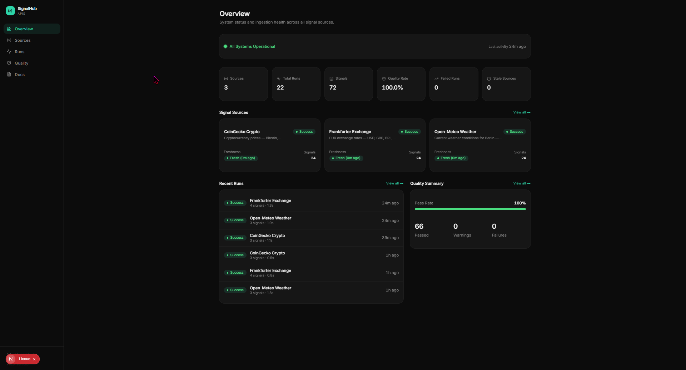
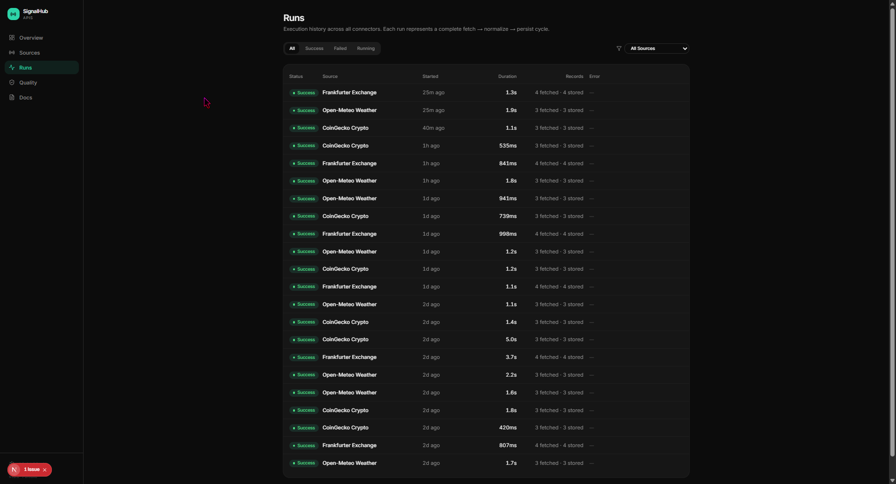
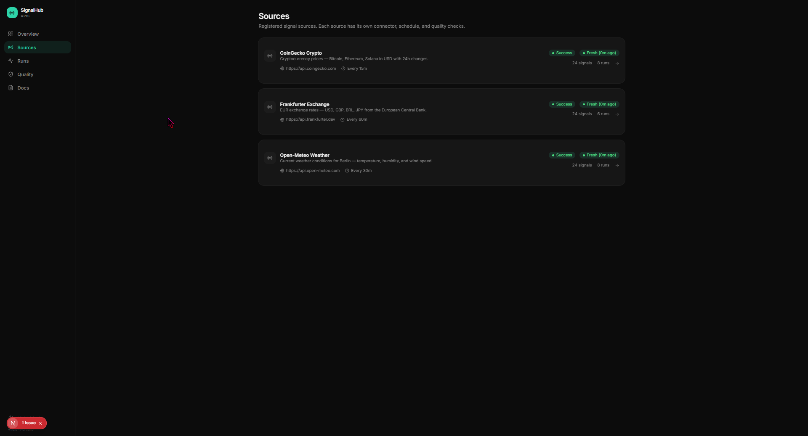
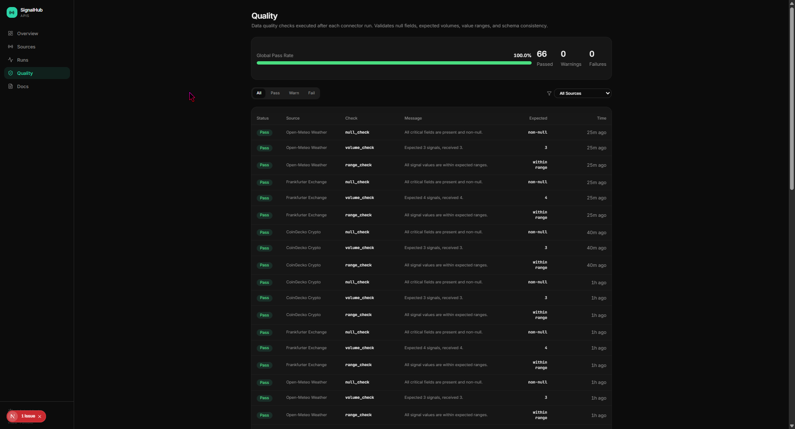
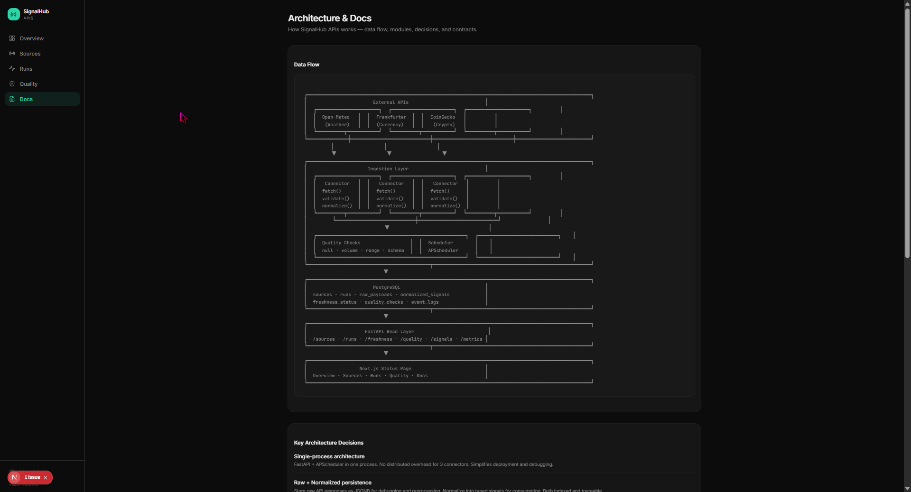

<div align="center">
  

  <h1>SignalHub APIs</h1>

  <p><strong>Backend analytics made visible, reliable and explainable</strong></p>
  <p><strong>Analytics de backend visível, confiável e explicável</strong></p>

  <p>
    <a href="#pt-br">PT-BR</a> •
    <a href="#en">English</a> •
    <a href="#tech-stack">Tech Stack</a> •
    <a href="#quick-start--início-rápido">Quick Start</a> •
    <a href="#api-endpoints">API</a> •
    <a href="#autor--author">Autor</a>
  </p>

  <p>
    
    
    
    
    
    
    
  </p>
</div>

---

<a id="pt-br"></a>

## 🇧🇷 PT-BR

## 📊 Visão geral

**SignalHub APIs** é uma plataforma de observabilidade de dados e integrações públicas criada para tornar o trabalho de backend analítico **visível, rastreável e explicável**.

O projeto integra múltiplas APIs públicas, normaliza respostas heterogêneas em um formato unificado de sinais, registra histórico de execução, monitora frescor dos dados, executa verificações de qualidade e expõe tudo em um dashboard premium construído com Next.js.

A proposta é demonstrar, em formato de produto técnico de portfólio, o ciclo completo de engenharia de dados aplicada:

- ingestão;
- validação;
- normalização;
- persistência;
- agendamento;
- qualidade;
- frescor;
- observabilidade;
- visualização operacional.

> **Objetivo:** mostrar que integrações e pipelines de dados não precisam ser caixas-pretas. Eles podem ser acompanhados, auditados e explicados.

---

## 🎯 Problema

A maior parte do trabalho real de backend e engenharia de dados acontece de forma invisível:

- pipelines rodam silenciosamente;
- integrações quebram sem aviso claro;
- dados ficam desatualizados sem indicador visual;
- qualidade degrada sem checks;
- históricos de execução ficam escondidos;
- o trabalho técnico existe, mas não aparece para quem precisa decidir.

Isso torna difícil responder perguntas simples, mas críticas:

- A fonte está ativa?
- A última execução falhou?
- Os dados ainda estão frescos?
- Quantos registros foram processados?
- A qualidade passou nos critérios mínimos?
- Qual conector está gerando problema?

O **SignalHub APIs** existe para resolver essa invisibilidade.

---

## 💡 Solução

O SignalHub transforma integrações públicas em uma camada observável de sinais.

| Trabalho invisível | Saída visível |
|---|---|
| Integração entre fontes heterogêneas | Conectores com status operacional |
| Contratos e normalização de dados | Schemas e sinais padronizados |
| Histórico de execução | Timeline de runs com métricas |
| Frescor dos dados | Indicadores de staleness |
| Gates de qualidade | Checks com pass, warning e fail |
| Estado do sistema | Dashboard com KPIs e detalhes |

Diferente de um dashboard simples que apenas exibe dados finais, o projeto mostra o que aconteceu no caminho: quando rodou, quanto demorou, o que processou, se falhou e se a qualidade passou.

---

## ✨ Funcionalidades principais

### 🔌 Integração de dados

- 3 conectores de APIs públicas:
  - **Open-Meteo:** clima, temperatura, umidade e vento.
  - **Frankfurter:** taxas de câmbio.
  - **CoinGecko:** preços de criptomoedas.
- Agendamento automático com intervalos diferentes por fonte.
- Execuções manuais por endpoint.
- Idempotência para evitar runs duplicados na mesma janela.
- Tratamento de erros com logging detalhado.

### 🧹 Processamento

- Validação por schemas Pydantic.
- Normalização de APIs heterogêneas para formato unificado.
- Separação entre payload bruto e sinal normalizado.
- Persistência de histórico de runs.
- Deduplicação por chave de idempotência.

### 📊 Observabilidade

- Histórico completo de execuções.
- Status de sucesso, falha e execução em andamento.
- Duração de cada run.
- Quantidade de registros buscados e armazenados.
- Indicadores de frescor por fonte.
- Checks de qualidade por execução.
- Métricas consolidadas do sistema.

### 📈 Dashboard premium

- Overview com KPIs principais.
- Página de sources com status e último run.
- Página de detalhe por fonte.
- Timeline de runs.
- Página de qualidade com breakdown pass/fail/warning.
- Dark mode com visual premium.
- Consumo de dados reais do backend.

---

## 🖼️ Screenshots

Adicione os arquivos em `docs/screenshots/` para exibir a interface no README:

```md





```

---

<a id="en"></a>

## 🇺🇸 English

## 📊 Overview

**SignalHub APIs** is a data observability and public API integration platform designed to make analytical backend work **visible, traceable and explainable**.

The project integrates multiple public APIs, normalizes heterogeneous responses into a unified signal format, tracks execution history, monitors data freshness, runs quality checks and exposes everything through a premium Next.js dashboard.

It demonstrates the full applied data engineering lifecycle as a portfolio-grade technical product:

- ingestion;
- validation;
- normalization;
- persistence;
- scheduling;
- quality checks;
- freshness monitoring;
- observability;
- operational visualization.

> **Goal:** show that integrations and data pipelines do not have to be black boxes. They can be monitored, audited and explained.

---

## 🎯 Problem

Most real backend and data engineering work is invisible:

- pipelines run silently;
- integrations break without clear alerts;
- data becomes stale without visual indicators;
- quality degrades without checks;
- execution history remains hidden;
- the technical work exists, but the output is not visible to decision-makers.

This makes it hard to answer simple but critical questions:

- Is the source active?
- Did the last run fail?
- Is the data still fresh?
- How many records were processed?
- Did the quality checks pass?
- Which connector is causing problems?

**SignalHub APIs** exists to solve this invisibility.

---

## 💡 Solution

SignalHub turns public API integrations into an observable layer of signals.

| Invisible work | Visible output |
|---|---|
| Integration between heterogeneous sources | Connectors with operational status |
| Data contracts and normalization | Schemas and standardized signals |
| Execution history | Run timeline with metrics |
| Data freshness | Staleness indicators |
| Quality gates | Checks with pass, warning and fail |
| System state | Dashboard with KPIs and details |

Unlike a simple dashboard that only displays final data, this project shows what happened along the way: when it ran, how long it took, what it processed, whether it failed and whether quality checks passed.

---

## ✨ Key features

### 🔌 Data integration

- 3 public API connectors:
  - **Open-Meteo:** weather, temperature, humidity and wind speed.
  - **Frankfurter:** currency exchange rates.
  - **CoinGecko:** cryptocurrency prices.
- Automatic scheduling with different intervals per source.
- Manual run trigger through API endpoints.
- Idempotency to avoid duplicate runs in the same time window.
- Error handling with detailed logging.

### 🧹 Processing

- Validation through Pydantic schemas.
- Normalization from heterogeneous APIs into a unified signal format.
- Separation between raw payloads and normalized signals.
- Persistent run history.
- Deduplication through idempotency keys.

### 📊 Observability

- Complete execution history.
- Success, failure and running statuses.
- Duration per run.
- Number of records fetched and stored.
- Freshness indicators per source.
- Quality checks per run.
- System-wide metrics.

### 📈 Premium dashboard

- Overview with main KPIs.
- Sources page with status and last run.
- Source detail page.
- Runs timeline.
- Quality page with pass/fail/warning breakdown.
- Premium dark-mode interface.
- Real backend data consumption.

---

## 🖼️ Screenshots

Add files to `docs/screenshots/` to display the interface in the README:

```md


```

---

<a id="tech-stack"></a>

## 🛠️ Tech Stack

### Backend

| Layer | Technology |
|---|---|
| Framework | FastAPI 0.115 |
| Language | Python 3.12 |
| Database | SQLite for development / PostgreSQL for production |
| ORM | SQLAlchemy 2.0 async |
| Migrations | Alembic |
| Validation | Pydantic 2.7 |
| Scheduling | APScheduler 3.10 |
| HTTP Client | httpx |

### Frontend

| Layer | Technology |
|---|---|
| Framework | Next.js 16 App Router |
| Language | TypeScript strict |
| Styling | Tailwind CSS + shadcn/ui |
| Charts | Recharts |
| State | React Context |
| Icons | Lucide React |

### DevOps

| Tool | Purpose |
|---|---|
| GitHub Actions | CI/CD pipeline |
| Docker | Containerization |
| Vercel | Frontend hosting |
| Railway / Render | Backend hosting |

---

## 🏗️ Architecture / Arquitetura

```txt
┌─────────────────────────────────────────────────────────────┐
│                      Frontend (Next.js)                      │
│      Overview · Sources · Runs · Quality · Live Updates      │
└────────────────────────┬────────────────────────────────────┘
                         │ HTTP / REST
┌────────────────────────▼────────────────────────────────────┐
│                    Backend API (FastAPI)                     │
│   /health · /sources · /runs · /signals · /quality · metrics │
└────────────────────────┬────────────────────────────────────┘
                         │
        ┌────────────────┼────────────────┐
        │                │                │
┌───────▼──────┐ ┌──────▼──────┐ ┌──────▼──────┐
│  APScheduler │ │  Database   │ │  Ingestion  │
│    Jobs      │ │   SQLite    │ │  Pipeline   │
└───────┬──────┘ └─────────────┘ └──────┬──────┘
        │                                │
        │         ┌──────────────────────┘
        │         │
┌───────▼─────────▼──────────────────────────────────────────┐
│                    Connectors                               │
│           Open-Meteo · Frankfurter · CoinGecko              │
└─────────────────────────────────────────────────────────────┘
```

---

## 🔄 Data Flow / Fluxo de dados

```txt
[Public API]
    ↓
[Connector]
    ↓
[Validator]
    ↓
[Normalizer]
    ↓
[Persister]
    ↓
[Quality Checker]
    ↓
[Dashboard]
```

| Step | Responsibility | Output |
|---|---|---|
| Fetch | HTTP request to public API | Raw JSON response |
| Validate | Pydantic schema validation | Typed data object |
| Normalize | Transform into unified signal format | `NormalizedSignal[]` |
| Persist | Store raw and normalized data | Database records |
| Quality Check | Validate completeness, range and consistency | `QualityCheck[]` |
| Freshness | Calculate staleness | `FreshnessStatus` |
| Expose | REST API endpoints | JSON responses |

---

## 📁 Project Structure / Estrutura do projeto

```txt
signalhub-apis/
├── apps/
│   ├── api/
│   │   ├── app/
│   │   │   ├── db/              # Models, engine and migrations
│   │   │   ├── routers/         # API endpoints
│   │   │   ├── schemas/         # Pydantic schemas
│   │   │   ├── services/        # Business logic
│   │   │   ├── config.py        # Configuration
│   │   │   └── main.py          # FastAPI app and scheduler
│   │   ├── alembic/
│   │   └── requirements.txt
│   │
│   └── web/
│       ├── src/
│       │   ├── app/             # Next.js App Router pages
│       │   ├── components/      # React components
│       │   └── lib/             # API client and utilities
│       └── package.json
│
├── packages/
│   └── ingestion/
│       ├── connectors/          # API connectors
│       ├── jobs/                # Job runner
│       ├── quality/             # Quality checks
│       └── transforms/          # Data transformations
│
├── docs/
├── scripts/
├── DEVELOPER.md
├── VALIDATION.md
└── README.md
```

---

<a id="quick-start--início-rápido"></a>

## 🚀 Quick Start / Início rápido

### Prerequisites / Pré-requisitos

- Python 3.12+
- Node.js 20+
- npm or pnpm

### Quick Start on Windows

```bash
git clone https://github.com/BarujaFe1/signalhub-apis.git
cd signalhub-apis
start.bat
```

### Manual start

#### Terminal 1 — Backend

```bash
cd apps/api
python -m venv venv

# Windows
venv\Scripts\activate

# Linux/macOS
source venv/bin/activate

pip install -r requirements.txt
uvicorn app.main:app --host 0.0.0.0 --port 8000 --reload
```

#### Terminal 2 — Frontend

```bash
cd apps/web
npm install
npm run dev
```

### Access

```txt
Frontend:    http://localhost:3001
API:         http://localhost:8000
API Docs:    http://localhost:8000/docs
Health:      http://localhost:8000/health
```

---

<a id="api-endpoints"></a>

## 🔗 API Endpoints

### Health

- `GET /health` — system health check

### Sources

- `GET /api/v1/sources` — list all data sources
- `GET /api/v1/sources/{slug}` — get source detail with runs, signals and quality

### Runs

- `GET /api/v1/runs` — list execution history
- `GET /api/v1/runs/{id}` — get run detail
- `POST /api/v1/runs/trigger/{slug}` — trigger manual run

### Data

- `GET /api/v1/signals` — list normalized signals
- `GET /api/v1/freshness` — get freshness status for all sources
- `GET /api/v1/quality` — list quality checks

### Metrics

- `GET /api/v1/metrics/summary` — system-wide metrics

---

## 🧬 Data Schema / Modelo de dados

### Source

```python
class Source:
    id: UUID
    slug: str
    name: str
    description: str
    api_base_url: str
    schedule_interval_minutes: int
    is_active: bool
    created_at: datetime
    updated_at: datetime
```

### Run

```python
class Run:
    id: UUID
    source_id: UUID
    status: str
    started_at: datetime
    finished_at: datetime | None
    duration_ms: int | None
    records_fetched: int
    records_stored: int
    error_message: str | None
    idempotency_key: str
```

### NormalizedSignal

```python
class NormalizedSignal:
    id: UUID
    source_id: UUID
    run_id: UUID
    signal_type: str
    signal_key: str
    signal_value: float
    signal_unit: str
    observed_at: datetime
    metadata: dict | None
```

### QualityCheck

```python
class QualityCheck:
    id: UUID
    run_id: UUID
    check_name: str
    check_status: str
    check_message: str
    checked_at: datetime
```

---

## 🔌 Connectors / Conectores

| Connector | Data | Schedule | Auth |
|---|---|---|---|
| Open-Meteo | Weather: temperature, humidity, wind speed | Every 30 min | None |
| Frankfurter | EUR exchange rates: USD, GBP, BRL, JPY | Every 60 min | None |
| CoinGecko | BTC and ETH prices in USD | Every 15 min | Optional API key |

---

## ✅ Quality Checks / Checks de qualidade

| Check | Description | Pass criteria |
|---|---|---|
| Completeness | Required fields are present | 100% of signals include required fields |
| Range | Values are within expected bounds | Temperature between -50 and 50°C, prices greater than 0 |
| Consistency | Data matches expected patterns | Rates and keys follow expected structure |
| Freshness | Data is recent | Timestamp within configured freshness window |

---

## 🧪 Validation Report / Relatório de validação

Current validation status from the project documentation:

| Component | Status | Details |
|---|---|---|
| Backend API | Running | 8/8 endpoints functional |
| Frontend | Running | Pages consuming real data |
| Database | Initialized | 7 tables, 19 runs, 62 signals |
| Connectors | Active | 3/3 sources executing |
| Scheduler | Active | Jobs registered and running |
| Quality | Passing | 100% pass rate reported |

See [VALIDATION.md](./VALIDATION.md) for the full validation report.

---

## 🗺️ Roadmap

| Version | Status | Scope |
|---|---|---|
| V1.0 | Shipped | 3 connectors, dashboard, quality checks, freshness monitoring |
| V1.1 | Next | PostgreSQL, Docker, CI/CD, deployment |
| V2.0 | Planned | More connectors, alerting, data export, historical analytics |

---

## 📚 Documentation / Documentação

- [DEVELOPER.md](./DEVELOPER.md) — development guide
- [VALIDATION.md](./VALIDATION.md) — validation report
- [API Docs](http://localhost:8000/docs) — local Swagger documentation

---

## 🤝 Contributing / Contribuição

```bash
git checkout -b feature/your-feature
git commit -m "feat: describe your change"
git push origin feature/your-feature
```

Then open a Pull Request.

---

<a id="autor--author"></a>

## 👤 Autor / Author

Developed by **Felipe Baruja** — Product Engineer · Data & Automation.

- **Portfolio:** [https://barujafe.vercel.app/](https://barujafe.vercel.app/)
- **GitHub:** [github.com/BarujaFe1](https://github.com/BarujaFe1)
- **LinkedIn:** [linkedin.com/in/barujafe](https://www.linkedin.com/in/barujafe)

---

## 📄 License / Licença

MIT License.

See [LICENSE](./LICENSE) for details.

---

## 🙏 Acknowledgments / Agradecimentos

Built with open-source tools:

[FastAPI](https://fastapi.tiangolo.com/) · [Next.js](https://nextjs.org/) · [SQLAlchemy](https://www.sqlalchemy.org/) · [Pydantic](https://docs.pydantic.dev/) · [shadcn/ui](https://ui.shadcn.com/) · [Recharts](https://recharts.org/) · [APScheduler](https://apscheduler.readthedocs.io/)

---

<div align="center">
  <p><strong>SignalHub APIs</strong></p>
  <p>Backend analytics made visible, reliable and explainable.</p>
  <p><em>Analytics de backend visível, confiável e explicável.</em></p>
</div>
