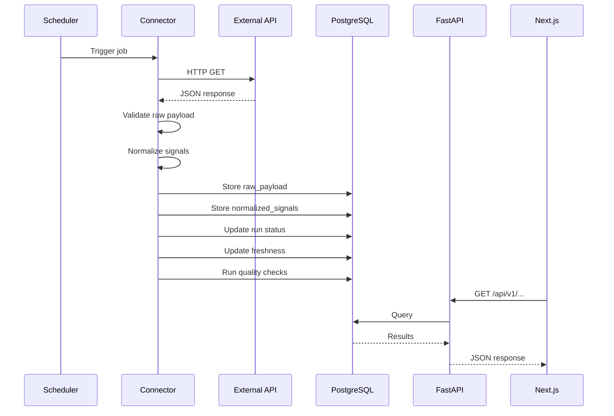

# Architecture

## Overview

SignalHub APIs follows a single-process architecture where the API server, scheduler, and ingestion layer coexist in one FastAPI process. This is a deliberate V1 decision: no distributed complexity, no message queues, no separate workers.

## Data Flow

## Modules

### Frontend (`apps/web`)
Next.js 15 App Router with TypeScript. Five pages: Overview, Sources, Runs, Quality, Docs. Consumes the FastAPI read layer.

### Backend (`apps/api`)
FastAPI with async SQLAlchemy. Exposes read endpoints for the frontend. Hosts the scheduler via lifespan events.

### Ingestion (`packages/ingestion`)
Connector layer with base class, per-source connectors, Pydantic contracts, transforms, and quality checks. Imported by the API process.

### Persistence
PostgreSQL 16 with 7 tables: sources, runs, raw_payloads, normalized_signals, freshness_status, quality_checks, event_logs.

## Key Decisions

| Decision | Rationale |
|----------|-----------|
| Single process | V1 scope. No need for distributed architecture. Simplifies deployment and debugging. |
| APScheduler in-process | Lightweight, no external dependencies. Runs in the same event loop as FastAPI. |
| No Celery/Airflow | Overkill for 3 connectors. Would add operational complexity without V1 value. |
| Raw + normalized storage | Preserves original data for debugging while providing clean signals for consumption. |
| Idempotency keys | Prevents duplicate runs within the same time window. Simple and effective. |
| No auth in V1 | Portfolio project. Auth adds complexity without demonstrating data engineering skills. |
| PostgreSQL only | One database. No Redis, no Elasticsearch. Postgres handles everything in V1. |

## Deployment

V1 runs locally via Docker Compose. The compose file includes PostgreSQL, the API, and the frontend. For public demos, the API and frontend can be deployed to any container host.
