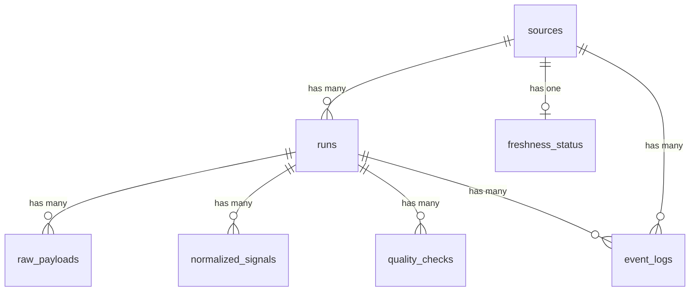

# Data Model

## Entity Relationship

## Tables

### sources
Registered data sources. Seeded at startup.

| Column | Type | Notes |
|--------|------|-------|
| id | UUID | PK |
| slug | VARCHAR(50) | Unique. `open-meteo`, `frankfurter`, `coingecko` |
| name | VARCHAR(100) | Display name |
| description | TEXT | |
| api_base_url | VARCHAR(255) | |
| schedule_interval_minutes | INTEGER | |
| is_active | BOOLEAN | Default true |
| created_at | TIMESTAMPTZ | |
| updated_at | TIMESTAMPTZ | |

### runs
Each execution of a connector job.

| Column | Type | Notes |
|--------|------|-------|
| id | UUID | PK |
| source_id | UUID | FK → sources |
| status | VARCHAR(20) | `running`, `success`, `failed`, `partial` |
| started_at | TIMESTAMPTZ | |
| finished_at | TIMESTAMPTZ | Null while running |
| duration_ms | INTEGER | |
| records_fetched | INTEGER | |
| records_stored | INTEGER | |
| error_message | TEXT | Null on success |
| idempotency_key | VARCHAR(100) | `{slug}:{YYYY-MM-DD}:{HH}` |
| created_at | TIMESTAMPTZ | |

### raw_payloads
Full API responses stored as JSONB for debugging and reprocessing.

| Column | Type | Notes |
|--------|------|-------|
| id | UUID | PK |
| run_id | UUID | FK → runs |
| source_id | UUID | FK → sources |
| payload | JSONB | |
| fetched_at | TIMESTAMPTZ | |
| payload_hash | VARCHAR(64) | SHA-256 |

### normalized_signals
Cleaned, typed, uniform signal values.

| Column | Type | Notes |
|--------|------|-------|
| id | UUID | PK |
| run_id | UUID | FK → runs |
| source_id | UUID | FK → sources |
| signal_type | VARCHAR(50) | `weather`, `exchange_rate`, `crypto_price` |
| signal_key | VARCHAR(100) | `temperature_celsius`, `EUR_USD`, `bitcoin_usd` |
| signal_value | NUMERIC | |
| signal_unit | VARCHAR(30) | `°C`, `USD`, etc. |
| observed_at | TIMESTAMPTZ | |
| metadata | JSONB | Extra context |
| created_at | TIMESTAMPTZ | |

### freshness_status
One row per source. Updated after each run.

| Column | Type | Notes |
|--------|------|-------|
| id | UUID | PK |
| source_id | UUID | FK → sources, unique |
| last_success_at | TIMESTAMPTZ | |
| last_attempt_at | TIMESTAMPTZ | |
| last_run_id | UUID | FK → runs |
| is_stale | BOOLEAN | |
| staleness_minutes | INTEGER | |
| updated_at | TIMESTAMPTZ | |

### quality_checks
Results of quality validations per run.

| Column | Type | Notes |
|--------|------|-------|
| id | UUID | PK |
| run_id | UUID | FK → runs |
| source_id | UUID | FK → sources |
| check_name | VARCHAR(100) | `null_check`, `volume_check`, etc. |
| check_status | VARCHAR(20) | `pass`, `warn`, `fail` |
| expected_value | VARCHAR(255) | |
| actual_value | VARCHAR(255) | |
| message | TEXT | |
| checked_at | TIMESTAMPTZ | |

### event_logs
System-wide event log for operational visibility.

| Column | Type | Notes |
|--------|------|-------|
| id | UUID | PK |
| source_id | UUID | FK → sources, nullable |
| run_id | UUID | FK → runs, nullable |
| event_type | VARCHAR(50) | |
| severity | VARCHAR(20) | `info`, `warning`, `error` |
| message | TEXT | |
| details | JSONB | |
| created_at | TIMESTAMPTZ | |
